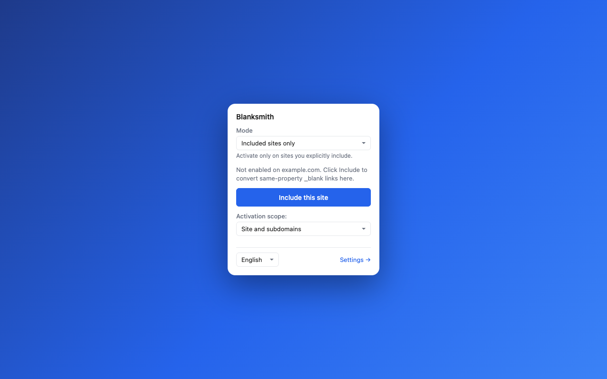
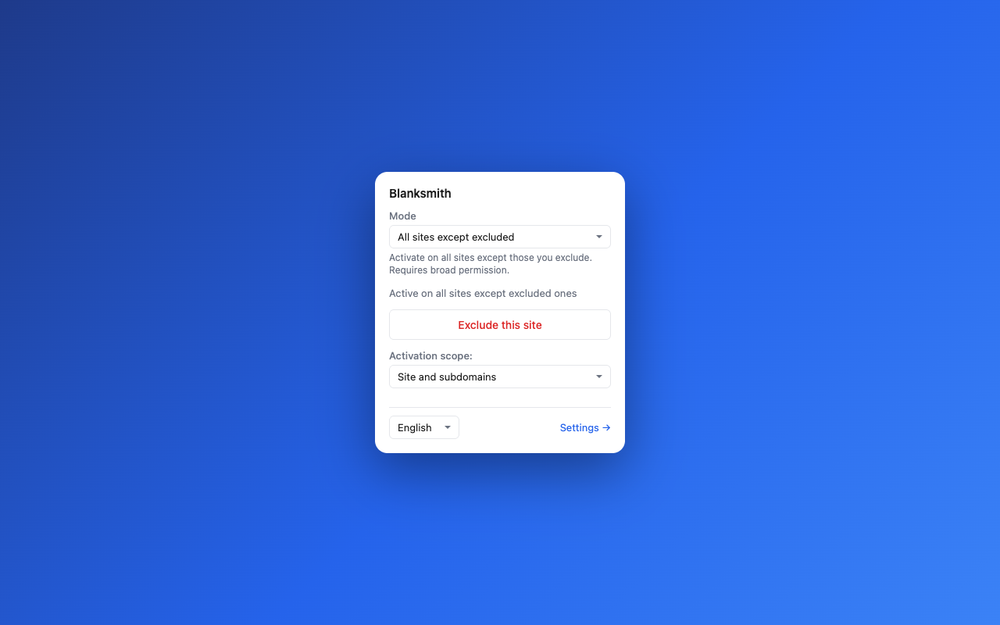

# Blanksmith

English | [简体中文](README.zh-CN.md)

## Keep your tab bar calm. 🌱

**Open the links that belong here in this tab. Keep a fresh tab for somewhere
genuinely new.**

Blanksmith is a small Chrome extension for a big tab-bar problem: websites
that open every `target="_blank"` link in another tab. On sites you choose, it
keeps same-property links right where you are—without taking away the new tabs
that are actually useful.

No accounts. No telemetry. No extension-initiated network requests. No bundled
site list. Your browser, your rules.



## Ready? Go. ✨

### 1. Visit the noisy site

Open a site where same-site links keep bouncing you into new tabs.

### 2. Tap the Blanksmith icon

Choose **Include this site**, then approve Chrome's permission prompt for that
site.

### 3. Keep browsing

Same-property `_blank` links now open in your current tab. A destination that
Blanksmith classifies as a different property keeps its new-tab behavior.
**Small change. Calmer browsing.** 🎉

## Put the rules in your hands 🎯

| You choose | Blanksmith does |
|---|---|
| **Included sites only** (the default) | Works only on sites you explicitly include. |
| **All sites except excluded** | Works everywhere, except the sites you exclude. |
| **Same property** (the default boundary) | Keeps same-property links in the current tab and preserves new tabs for different properties. |
| **Related domains** | Lets you explicitly say that another domain belongs to the same product. |
| **Convert all** (advanced) | Opens all matching `_blank` links in the current tab—including different-property destinations. Use it only when that is what you want. |

Rules begin empty. There are no hidden presets. In Settings, each rule can
cover a whole site or one hostname, and you can switch between the safe default
and the advanced behavior whenever you need to.



## These clicks stay yours 🛡️

Blanksmith deliberately leaves these alone:

- Cmd/Ctrl/Shift-clicks and middle-clicks
- download links
- links marked `rel="external"`
- every link on a site you have not enabled

It never rewrites the page's `target` attribute. When a rule permits a
conversion, it uses `preventDefault()` plus normal browser navigation
(`location.assign()`) at click time.

## Private by design

- No developer-operated backend, analytics, ads, remote code, or
  extension-initiated `fetch`, XHR, or WebSocket requests.
- Only your rules and preferences are stored in `chrome.storage.sync`. On an
  enabled page, it reads only the clicked link details needed for that one
  decision—not page text, forms, cookies, or your browsing history.

Read the details in [Privacy](PRIVACY.md) and [Security](SECURITY.md).

## Honest little asterisks

- "Same property" normally means the same registrable domain (eTLD+1),
  calculated locally with a Public Suffix List parser that recognizes private
  suffixes. It cannot prove
  common ownership across different domains; related domains are always your
  explicit choice.
- Multi-tenant hosts such as `github.io` stay separate by default. Use the
  same-host boundary when that is safer.
- Version 1 handles effective `_blank` links on anchors and image-map areas,
  including `<base target="_blank">`. It does not intercept `window.open`,
  forms, frames, or closed shadow roots.

## Install from source

The Chrome Web Store listing is not published yet. To use Blanksmith today:

```sh
pnpm install
pnpm build
```

Then open `chrome://extensions`, enable **Developer mode**, click **Load
unpacked**, and select `.output/chrome-mv3/`. Pin the icon—and give your tab
bar some breathing room.

<details>
<summary><strong>Building, testing, and contributing</strong></summary>

```sh
pnpm verify       # test, typecheck, build, and verify Store artwork
pnpm assets:store # regenerate deterministic Store and social images
```

Read [CONTRIBUTING.md](CONTRIBUTING.md) before contributing. The complete rule
model, manual Chrome checks, and Store materials live in
[MANUAL_TEST.md](MANUAL_TEST.md), [STORE_LISTING.md](STORE_LISTING.md), and
[store-assets/README.md](store-assets/README.md).

</details>

Have a bug or a bright idea? Open a [GitHub issue](https://github.com/TiantianFlow/blanksmith/issues)—just leave personal browsing data and credentials out of it.

## License

[MIT](LICENSE) © 2026 TiantianFlow
