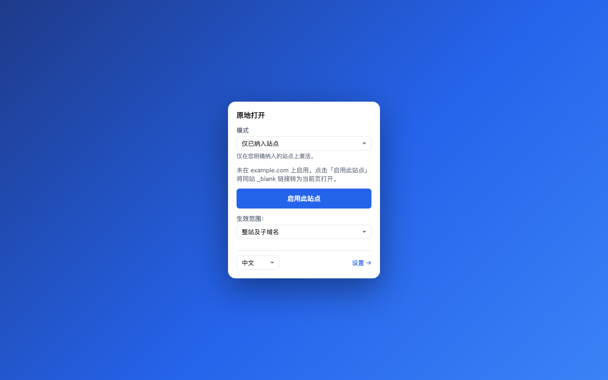
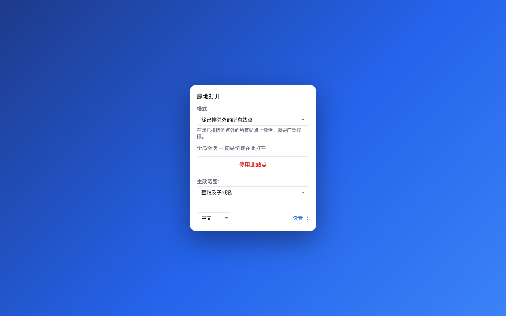

# 原地打开

[English](README.md) | 简体中文

## 别让新标签页把你带走。🌱

**站内链接，原地打开；真正的新去处，留给新标签页。**

“原地打开”是一款轻巧的 Chrome 扩展，专治一种很常见的标签页灾难：网站把每一个
`target="_blank"` 链接都扔进新标签页。对你主动启用的网站，它会把同一属性范围内的
同站范围内的链接留在当前标签页；真正前往另一个网站的链接，依然按原样新开标签。

不需要账号。不收集遥测数据。不发起扩展自身的网络请求。没有内置网站名单。浏览器是你
的，规则也是你定的。



## 三步开用，先赢一局 ✨

### 1. 打开那个总爱开新标签的网站

找到一个连站内链接也喜欢另开标签页的网站。

### 2. 点击“原地打开”图标

选择 **启用此站点**，再同意 Chrome 针对该站点显示的权限提示。

### 3. 继续逛

同站范围内的 `_blank` 链接现在会在当前标签页打开；被识别为不同站点的目标仍保留
原本的新标签行为。**小小一步，标签页清静很多。** 🎉

## 把规则交给你 🎯

| 由你决定 | 原地打开会… |
|---|---|
| **仅已纳入站点**（默认） | 只在你明确启用的站点生效。 |
| **除已排除站点外的所有站点** | 在所有站点生效，但跳过你排除的站点。 |
| **同站范围**（默认边界） | 同站范围内留在当前标签；不同站点目标保留新标签。 |
| **关联域名** | 由你明确指定另一个域名也属于同一个产品。 |
| **全部转为当前标签**（高级） | 所有匹配的 `_blank` 链接都留在当前标签，包括不同属性的目标。只在你确实想这样做时开启。 |

规则列表一开始是空的，没有隐藏预设。每条规则都可以覆盖整个站点或单个主机名；随时可以
在稳妥的默认行为与高级行为之间切换。



## 这些操作绝不打扰 🛡️

“原地打开”会坚定地放过：

- Cmd/Ctrl/Shift 点击与中键点击
- 下载链接
- 标记为 `rel="external"` 的链接
- 你尚未启用站点中的每一个链接

它从不改写页面的 `target` 属性。只有当你的规则允许时，它才会在点击瞬间用
`preventDefault()` 加上普通浏览器导航（`location.assign()`）完成转换。

## 隐私很简单

- 没有开发者运营的后端、分析、广告、远程代码，也没有扩展自身发起的 `fetch`、XHR 或
  WebSocket 请求。
- 只在 `chrome.storage.sync` 保存你的规则与偏好。在已启用页面上，只读取这一次判断所需的
  被点击链接信息；不会读取页面正文、表单、Cookie 或浏览历史。

详细说明请见 [隐私说明](PRIVACY.md) 与 [安全说明](SECURITY.md)（英文）。

## 几条坦诚的小字

- 默认的“同站范围”指相同的可注册域名（eTLD+1），并在本地使用支持私有后缀的 Public
  Suffix List 解析器计算。它无法证明两个不同域名是否同属一家公司；关联域名永远由你明确指定。
- 像 `github.io` 这样的多租户域名默认按账号区分；如果更稳妥，可以选择只匹配相同主机名。
- 版本 1 处理锚点和图像映射区域上的有效 `_blank` 链接，也包括
  `<base target="_blank">`。`window.open`、表单、框架与闭合 Shadow Root 暂不处理。

## 从源码安装

Chrome 应用商店版本尚未发布。现在即可通过源码使用：

```sh
pnpm install
pnpm build
```

然后打开 `chrome://extensions`，启用**开发者模式**，点击**加载已解压的扩展程序**，选择
`.output/chrome-mv3/`。固定工具栏图标，然后把标签页的呼吸空间还给自己。

<details>
<summary><strong>构建、测试与贡献</strong></summary>

```sh
pnpm verify       # 测试、类型检查、构建，并校验应用商店图片
pnpm assets:store # 重新生成可复现的应用商店与社交图片
```

贡献前请阅读 [CONTRIBUTING.md](CONTRIBUTING.md)（英文）。完整规则模型、Chrome 手动测试
与应用商店材料分别在 [MANUAL_TEST.md](MANUAL_TEST.md)、
[STORE_LISTING.md](STORE_LISTING.md) 和
[store-assets/README.md](store-assets/README.md)（英文）。

</details>

发现问题或有好点子？欢迎提交 [GitHub Issue](https://github.com/TiantianFlow/blanksmith/issues)。
请不要附上个人浏览数据或凭据。

## 许可证

[MIT](LICENSE) © 2026 TiantianFlow
